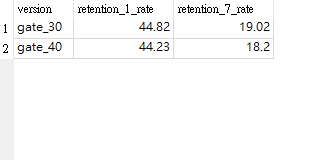

# 📱 手機遊戲 A/B 測試分析 (Mobile Game A/B Testing)

## 📌 專案背景
分析 90,000+ 名玩家數據，評估將遊戲關卡門檻從 **30 關 (Gate 30)** 移至 **40 關 (Gate 40)** 對用戶留存率的影響。

## 🛠️ 使用技術
* **SQL (SQLite):** 數據清洗、聚合運算、異常值偵測。
* **核心指標:** 1日留存率 (Day-1 Retention)、7日留存率 (Day-7 Retention)。

## 📊 分析結果
**圖表證據：**

**數據解讀：**
1. **異常值處理：** 排除了一名遊玩次數達 **49,854 次** 的異常測試帳號。
2. **關鍵發現：**
   * **Gate 30 (原版):** 7日留存率為 **19.02%**
   * **Gate 40 (新版):** 7日留存率下滑至 **18.20%**

## 💡 結論
數據顯示提高門檻會導致長期用戶流失。**建議維持 Gate 30 設定，不要進行改版。**
